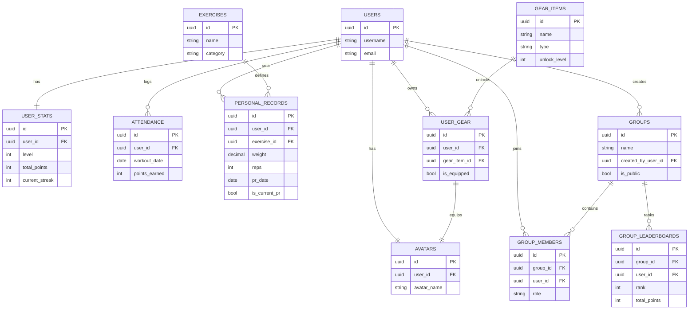

# Gym App - Entity Relationship Diagram (ERD)

## Overview
This document outlines the database schema for a gym app featuring attendance streaks, PR tracking, customizable avatars with unlockable gear, and group leaderboards.

## Visual ERD (Mermaid)


---

## Core Tables

### 1. **users**
Stores basic user account information.

| Column | Type | Constraints | Description |
|--------|------|-------------|-------------|
| id | UUID/INT | PRIMARY KEY | Unique user identifier |
| username | VARCHAR(50) | UNIQUE, NOT NULL | User's chosen username |
| email | VARCHAR(255) | UNIQUE, NOT NULL | User's email address |
| password_hash | VARCHAR(255) | NOT NULL | Hashed password |
| avatar_id | UUID/INT | FOREIGN KEY → avatars.id | Current avatar reference |
| created_at | TIMESTAMP | NOT NULL | Account creation timestamp |
| updated_at | TIMESTAMP | NOT NULL | Last update timestamp |

---

### 2. **user_stats**
Tracks user statistics, level, and points.

| Column | Type | Constraints | Description |
|--------|------|-------------|-------------|
| id | UUID/INT | PRIMARY KEY | Unique stat record ID |
| user_id | UUID/INT | FOREIGN KEY → users.id, UNIQUE | One-to-one with user |
| level | INT | NOT NULL, DEFAULT 1 | Current user level |
| total_points | INT | NOT NULL, DEFAULT 0 | Total points earned |
| current_streak | INT | NOT NULL, DEFAULT 0 | Current attendance streak (days) |
| longest_streak | INT | NOT NULL, DEFAULT 0 | Longest streak achieved |
| total_workouts | INT | NOT NULL, DEFAULT 0 | Total number of workouts logged |
| total_prs | INT | NOT NULL, DEFAULT 0 | Total PRs achieved |
| last_workout_date | DATE | NULL | Date of last workout (for streak calculation) |
| created_at | TIMESTAMP | NOT NULL | Record creation timestamp |
| updated_at | TIMESTAMP | NOT NULL | Last update timestamp |

**Relationships:**
- One-to-One with `users`

---

### 3. **attendance**
Tracks gym attendance/visits.

| Column | Type | Constraints | Description |
|--------|------|-------------|-------------|
| id | UUID/INT | PRIMARY KEY | Unique attendance record ID |
| user_id | UUID/INT | FOREIGN KEY → users.id, NOT NULL | User who attended |
| workout_date | DATE | NOT NULL | Date of workout |
| points_earned | INT | NOT NULL, DEFAULT 0 | Points earned for this attendance |
| notes | TEXT | NULL | Optional workout notes |
| created_at | TIMESTAMP | NOT NULL | Record creation timestamp |

**Relationships:**
- Many-to-One with `users`
- Unique constraint on (user_id, workout_date) to prevent duplicate entries

**Indexes:**
- Index on (user_id, workout_date DESC) for efficient streak queries

---

### 4. **exercises**
Master list of available exercises/lifts.

| Column | Type | Constraints | Description |
|--------|------|-------------|-------------|
| id | UUID/INT | PRIMARY KEY | Unique exercise ID |
| name | VARCHAR(100) | NOT NULL, UNIQUE | Exercise name (e.g., "Bench Press") |
| category | VARCHAR(50) | NOT NULL | Exercise category (e.g., "Chest", "Legs", "Back", "Shoulders", "Arms", "Core") |
| muscle_groups | JSON/ARRAY | NULL | Array of primary muscle groups |
| description | TEXT | NULL | Exercise description |
| unit | VARCHAR(10) | NOT NULL, DEFAULT 'lbs' | Unit of measurement (lbs/kg) |
| is_active | BOOLEAN | NOT NULL, DEFAULT true | Whether exercise is available |
| created_at | TIMESTAMP | NOT NULL | Record creation timestamp |

**Relationships:**
- One-to-Many with `personal_records`

---

### 5. **personal_records (PRs)**
Tracks personal records for exercises.

| Column | Type | Constraints | Description |
|--------|------|-------------|-------------|
| id | UUID/INT | PRIMARY KEY | Unique PR record ID |
| user_id | UUID/INT | FOREIGN KEY → users.id, NOT NULL | User who achieved the PR |
| exercise_id | UUID/INT | FOREIGN KEY → exercises.id, NOT NULL | Exercise for this PR |
| weight | DECIMAL(6,2) | NOT NULL | Weight lifted |
| reps | INT | NOT NULL | Number of repetitions |
| sets | INT | NULL | Number of sets (optional) |
| pr_date | DATE | NOT NULL | Date PR was achieved |
| points_earned | INT | NOT NULL, DEFAULT 0 | Points earned for this PR |
| is_current_pr | BOOLEAN | NOT NULL, DEFAULT true | Whether this is the user's current PR for this exercise |
| notes | TEXT | NULL | Optional notes about the PR |
| created_at | TIMESTAMP | NOT NULL | Record creation timestamp |

**Relationships:**
- Many-to-One with `users`
- Many-to-One with `exercises`
- Unique constraint on (user_id, exercise_id) WHERE is_current_pr = true

**Indexes:**
- Index on (user_id, exercise_id, pr_date DESC)
- Index on (user_id, is_current_pr) for quick current PR lookups

---

### 6. **avatars**
Stores user avatar information and customization.

| Column | Type | Constraints | Description |
|--------|------|-------------|-------------|
| id | UUID/INT | PRIMARY KEY | Unique avatar ID |
| user_id | UUID/INT | FOREIGN KEY → users.id, UNIQUE | One avatar per user |
| avatar_name | VARCHAR(50) | NULL | Custom avatar name |
| base_skin_color | VARCHAR(20) | NULL | Base skin color |
| base_hair_color | VARCHAR(20) | NULL | Base hair color |
| customization_data | JSON | NULL | Additional customization options |
| created_at | TIMESTAMP | NOT NULL | Avatar creation timestamp |
| updated_at | TIMESTAMP | NOT NULL | Last update timestamp |

**Relationships:**
- One-to-One with `users`
- One-to-Many with `avatar_gear` (equipped items)

---

### 7. **gear_items**
Master catalog of unlockable gear/equipment.

| Column | Type | Constraints | Description |
|--------|------|-------------|-------------|
| id | UUID/INT | PRIMARY KEY | Unique gear item ID |
| name | VARCHAR(100) | NOT NULL | Gear item name |
| type | VARCHAR(50) | NOT NULL | Gear type (e.g., "helmet", "shirt", "pants", "shoes", "gloves", "accessory") |
| rarity | VARCHAR(20) | NOT NULL, DEFAULT 'common' | Rarity level (common, uncommon, rare, epic, legendary) |
| unlock_level | INT | NULL | Minimum level required to unlock |
| unlock_pr_requirement | JSON | NULL | PR requirements (e.g., {"exercise_id": 1, "weight": 225}) |
| unlock_points_requirement | INT | NULL | Minimum points required |
| unlock_streak_requirement | INT | NULL | Minimum streak required |
| image_url | VARCHAR(255) | NULL | URL to gear image/icon |
| description | TEXT | NULL | Gear description |
| is_active | BOOLEAN | NOT NULL, DEFAULT true | Whether gear is available |
| created_at | TIMESTAMP | NOT NULL | Record creation timestamp |

**Relationships:**
- One-to-Many with `user_gear`

**Indexes:**
- Index on (type, rarity) for filtering

---

### 8. **user_gear**
Junction table tracking which gear users have unlocked and equipped.

| Column | Type | Constraints | Description |
|--------|------|-------------|-------------|
| id | UUID/INT | PRIMARY KEY | Unique record ID |
| user_id | UUID/INT | FOREIGN KEY → users.id, NOT NULL | User who owns the gear |
| gear_item_id | UUID/INT | FOREIGN KEY → gear_items.id, NOT NULL | Gear item unlocked |
| unlocked_at | TIMESTAMP | NOT NULL | When gear was unlocked |
| is_equipped | BOOLEAN | NOT NULL, DEFAULT false | Whether gear is currently equipped |
| unlocked_via | VARCHAR(50) | NULL | How it was unlocked (e.g., "level", "pr", "streak", "points") |

**Relationships:**
- Many-to-One with `users`
- Many-to-One with `gear_items`
- Unique constraint on (user_id, gear_item_id)

**Indexes:**
- Index on (user_id, is_equipped) for quick equipped gear lookups
- Index on (user_id, gear_item_id)

---

### 9. **groups**
User-created groups for leaderboards and social features.

| Column | Type | Constraints | Description |
|--------|------|-------------|-------------|
| id | UUID/INT | PRIMARY KEY | Unique group ID |
| name | VARCHAR(100) | NOT NULL | Group name |
| description | TEXT | NULL | Group description |
| created_by_user_id | UUID/INT | FOREIGN KEY → users.id, NOT NULL | User who created the group |
| is_public | BOOLEAN | NOT NULL, DEFAULT false | Whether group is publicly joinable |
| invite_code | VARCHAR(20) | UNIQUE, NULL | Unique invite code for private groups |
| max_members | INT | NULL | Maximum number of members (NULL = unlimited) |
| created_at | TIMESTAMP | NOT NULL | Group creation timestamp |
| updated_at | TIMESTAMP | NOT NULL | Last update timestamp |

**Relationships:**
- Many-to-One with `users` (creator)
- One-to-Many with `group_members`

**Indexes:**
- Index on (invite_code) for quick lookups
- Index on (is_public, created_at DESC)

---

### 10. **group_members**
Junction table for group membership.

| Column | Type | Constraints | Description |
|--------|------|-------------|-------------|
| id | UUID/INT | PRIMARY KEY | Unique membership record ID |
| group_id | UUID/INT | FOREIGN KEY → groups.id, NOT NULL | Group being joined |
| user_id | UUID/INT | FOREIGN KEY → users.id, NOT NULL | User joining the group |
| role | VARCHAR(20) | NOT NULL, DEFAULT 'member' | Role in group (admin, moderator, member) |
| joined_at | TIMESTAMP | NOT NULL | When user joined the group |
| last_active_at | TIMESTAMP | NULL | Last time user was active in group |

**Relationships:**
- Many-to-One with `groups`
- Many-to-One with `users`
- Unique constraint on (group_id, user_id)

**Indexes:**
- Index on (group_id, user_id)
- Index on (user_id) for user's groups lookup
- Index on (group_id, role) for admin queries

---

### 11. **group_leaderboards** (Optional - Can be derived)
Cached leaderboard data for groups (optional optimization table).

| Column | Type | Constraints | Description |
|--------|------|-------------|-------------|
| id | UUID/INT | PRIMARY KEY | Unique leaderboard entry ID |
| group_id | UUID/INT | FOREIGN KEY → groups.id, NOT NULL | Group for this leaderboard |
| user_id | UUID/INT | FOREIGN KEY → users.id, NOT NULL | User on leaderboard |
| rank | INT | NOT NULL | Current rank in group |
| total_points | INT | NOT NULL | User's total points |
| level | INT | NOT NULL | User's current level |
| current_streak | INT | NOT NULL | User's current streak |
| total_prs | INT | NOT NULL | User's total PRs |
| calculated_at | TIMESTAMP | NOT NULL | When leaderboard was last calculated |

**Relationships:**
- Many-to-One with `groups`
- Many-to-One with `users`
- Unique constraint on (group_id, user_id)

**Indexes:**
- Index on (group_id, rank ASC) for leaderboard queries
- Index on (group_id, calculated_at DESC)

**Note:** This table is optional and can be replaced with real-time queries against `user_stats`. Use this if you need to optimize leaderboard performance for large groups.

---

## Additional Considerations

### Points System
Points can be earned from:
- **Attendance**: Base points per workout + streak bonuses
- **PRs**: Points based on exercise difficulty and weight increase
- **Leveling**: Bonus points at level milestones

### Level System
Levels can be calculated based on:
- Total points accumulated
- Formula: `level = floor(sqrt(total_points / 100)) + 1` (example)

### Streak Calculation
- Streak is maintained if user logs attendance within 24-48 hours of last workout
- Streak breaks if gap exceeds threshold (e.g., 2 days)

### Gear Unlocking Logic
Gear can be unlocked via:
- **Level requirement**: User reaches specific level
- **PR requirement**: User achieves PR on specific exercise/weight
- **Streak requirement**: User maintains streak for X days
- **Points requirement**: User accumulates X total points
- **Combination**: Multiple requirements must be met

---

## Entity Relationship Summary

```
users (1) ──── (1) user_stats
users (1) ──── (1) avatars
users (1) ──── (*) attendance
users (1) ──── (*) personal_records
users (1) ──── (*) user_gear
users (1) ──── (*) group_members
users (1) ──── (*) groups (as creator)

exercises (1) ──── (*) personal_records

gear_items (1) ──── (*) user_gear

groups (1) ──── (*) group_members
groups (1) ──── (*) group_leaderboards (optional)

avatars (1) ──── (*) avatar_gear (equipped items via user_gear)
```

---

## Recommended Indexes Summary

1. **users**: email, username
2. **user_stats**: user_id (unique)
3. **attendance**: (user_id, workout_date), user_id
4. **personal_records**: (user_id, exercise_id), (user_id, is_current_pr)
5. **user_gear**: (user_id, gear_item_id), (user_id, is_equipped)
6. **group_members**: (group_id, user_id), user_id, (group_id, role)
7. **groups**: invite_code, (is_public, created_at)
8. **group_leaderboards**: (group_id, rank), (group_id, calculated_at)

---

## Next Steps

1. Choose database system (PostgreSQL, MySQL, etc.)
2. Create migration files
3. Implement seed data for exercises and initial gear items
4. Design API endpoints for each entity
5. Implement business logic for:
   - Streak calculation
   - Points calculation
   - Level progression
   - Gear unlocking
   - Leaderboard generation

